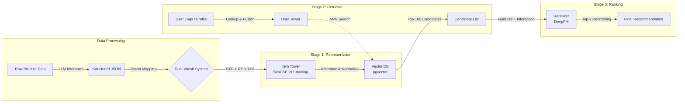
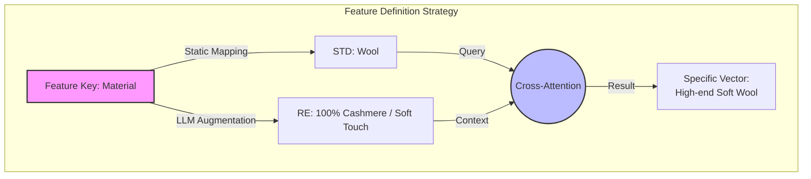
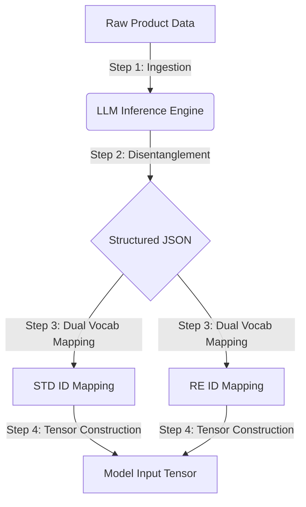

# 🛍️ LLM-Driven content-based Feature Recommendation System

## 📖 Overview

- **Project Duration:** 2024-10 ~ 2024-12 (Partial Impl) → **Complete AI Impl ver (Current, Logic 상세 구현)**
- **Previous Repo:** [github link](https://github.com/DotBlossom/flask-AI-inference-bedrock-controller)

이 프로젝트는 **LLM(Large Language Model)을 활용한 고품질 Feature Engineering**과 **Contrastive Learning(SimCSE)** 기반의 임베딩 학습을 결합한 차세대 커머스 추천 시스템입니다.

기존의 단순 협업 필터링(CF)이나 텍스트 기반 검색의 한계를 넘어, 상품의 **구조적 속성(Standard)** 과 **비정형 상세 속성(Reinforced)** 을 **Hierarchical Residual Embedding(계층적 잔차 임베딩)** 으로 전처리합니다.

이후, 이들을 **단일 시퀀스(Single Sequence)로 결합하여 Unified Transformer 내에서 속성 간의 상호작용(Self-Attention)을 학습하고, 최종적으로 Deep Residual MLP Layer로 압축하여** 정교한 벡터 공간을 구축합니다.

이를 바탕으로 **Two-Tower 구조의 Retrieval(후보 추출)** 과 **DeepFM 기반의 Reranking(정밀 정렬)** 파이프라인을 통해 유저의 신체 정보와 맥락까지 고려한 초개인화 추천을 제공합니다.


## Data Strategy & Processing Pipeline Overview

본 프로젝트의 데이터 아키텍처는 **"LLM을 활용한 표현력 증강(Representation Enrichment)"** 을 기반으로 설계되었습니다.

여기에 **AI Hub 패션 상품 데이터셋**과 호환 가능한 표준 스키마를 적용하여, 학습 데이터와 실제 서비스 데이터 간의 정합성을 보장하고 **Reranker(DeepFM, DLRM)** 등 고도화된 모듈로 즉시 확장 가능한 **범용적이고 유기적인 시스템**을 구축했습니다.

---

## 🏗️ System Architecture

전체 파이프라인은 데이터 전처리, 후보 추출(Retrieval), 정밀 정렬(Reranking)의 3단계로 구성됩니다.



## 🔑 Key Logics & Features

### 1. Hybrid Vocabulary System (Data Strategy)

데이터의 성격(정형/비정형)과 운영 효율성을 고려하여 이원화된 처리 전략을 사용합니다.

* **STD (Standard) Vocab**
    * 카테고리, 브랜드, 성별 등 고정된 도메인 피처.
    * 사전 정의된 **Finite Lookup Table**을 사용하여 정확한 의미를 보존합니다.
* **RE (Reinforced) Vocab**
    * 소재, 핏, 스타일 등 가변적이고 무한히 확장되는 상세 속성.
    * 별도의 사전 관리 없이 **Stateless Hashing (zlib)** 을 통해 고정된 차원의 ID로 즉시 변환하여, 서버 확장성과 운영 안정성을 극대화합니다.
* **Field Embedding**
    * 각 속성(Color, Season 등)의 역할을 정의하는 임베딩을 도입하여, STD와 RE가 동일한 위상 공간에서 상호작용하도록 유도합니다.

---

### 2. Stage 1: Item Tower (Coarse-to-Fine Representation)

상품의 본질적인 의미(Semantic)를 벡터화하는 단계로, **TabTransformer** 구조를 응용하여 설계되었습니다.

* **Architecture**
    * **Unified Transformer Encoder** + **Deep Residual Head (MLP)**
* **Hierarchical Residual Input (Core Logic)**
    * **단일 시퀀스(Single Sequence)** 내에서 위계 구조를 수식적으로 강제합니다.
    * **STD Token:** $Base\_Value + Field\_Key$
    * **RE Token:** $RE\_Delta + \text{StopGrad}(STD\_Base) + Field\_Key$
    * **Effect:** RE 피처는 독립적으로 존재하지 않고 STD를 **상속(Inheritance)** 받습니다. 이를 통해 데이터 희소성(Sparsity) 문제를 해결하고, 모델은 RE를 "STD와의 미세한 차이(Delta)"로 인식하여 학습 효율이 급증합니다.
* **Training Objective (SimCSE)**
    * **Augmentation:** 계층적 구조를 활용한 **Complementary Masking** (STD 위주 vs RE 위주) 및 Feature Dropout.
    * **Loss:** `NTXentLoss` (InfoNCE). 모델은 같은 상품의 뼈대(STD)와 살(RE)이 본질적으로 같음을 학습합니다.

---

### 3. Stage 2: User Tower (Multi-modal Retrieval)
유저의 행동, 현재 의도(Context), 신체 정보를 결합하여 선호 아이템을 탐색합니다.
* **3-Way Multi-modal Fusion:**
    1.  **Behavior:** 과거 구매/클릭 이력 Sequence (Pre-trained Item Vector Lookup + Transformer).
    2.  **Context:** 장바구니 컨셉 텍스트 (Transformer Encoder).
    3.  **Profile:** 키(Height), 몸무게(Weight) 등 수치형 데이터 (Linear Projection & Z-score Norm).
* **Strategy:** Item Tower의 가중치는 **Freeze(고정)**하고, 유저 타워만 학습하여 유저 벡터를 아이템 벡터 공간에 정렬(Alignment)시킵니다.

### 4. Stage 3: Reranker (Fine-grained Ranking)
Retrieval 단계에서 추려진 후보군을 정밀하게 재정렬합니다.
* **Model:** **DeepFM (Deep Factorization Machine)**
* **Weight Transfer:**
    * SimCSE로 학습된 **STD/RE 임베딩 가중치**를 DeepFM의 Sparse Feature Embedding으로 **이식(Transfer)**하여 초기 학습 성능을 극대화합니다.
* **Feature Interaction:**
    * **Sparse Feat:** 카테고리, 브랜드, RE 속성 (Shared Embeddings).
    * **Dense Feat:** 유저 키, 몸무게.
    * **Implicit Interaction:** DNN을 통해 고차원 상호작용 모델링.

---


---

## 2. Core Feature Strategy: STD-RE Symbiosis
우리는 상품을 단순한 텍스트 나열로 보지 않고, **동일한 Feature Key**를 공유하는 **부모(STD)와 자식(RE)**의 관계로 정의합니다.

### Unified Representation Mechanism (Delta Learning)

**STD(Standard)**와 **RE(Reinforced)**는 별개의 정보가 아닙니다. RE는 STD라는 **기준점(Anchor)** 위에서 얼마나 구체화되었는지를 나타내는 **변형(Variation)** 정보입니다.

| Feature Type | Role | Value Source | Input Logic |
| :--- | :--- | :--- | :--- |
| **STD (Base)** | **Structure (뼈대)** | Fixed Domain Vocab | $Emb(STD) + Emb(Field)$ |
| **RE (Detail)** | **Specification (살)** | **LLM-Augmented & Hashed** | $Emb(RE_{hash}) + \text{StopGrad}(Emb(STD)) + Emb(Field)$ |

* **Inheritance & Delta**
    * RE 토큰은 입력 단계에서 STD 벡터를 더하고 시작합니다. 따라서 초기 학습 시점부터 **"Cold Start"** 문제가 없습니다.
    * 학습이 진행될수록 STD가 표현하지 못하는 **"상세한 뉘앙스(Delta)"** 만을 집중적으로 학습합니다.
* **Effect**
    * 모든 피처가 **Unified Transformer** 내에서 평등하게 상호작용(Self-Attention)하되, 잔차 연결을 통해 구조적 연관성이 물리적으로 보장됩니다.
    * 이는 Cross-Attention 방식보다 훨씬 직관적이며 강력한 문맥 결합을 만들어냅니다.


## 3. Processing Pipeline (Step-by-Step)
전체 데이터 처리 과정은 **Raw Data 입력**부터 모델 학습을 위한 **Tensor 변환**까지 4단계로 이루어집니다.




### Step 1. LLM-Based Feature Enrichment
Raw Data(이미지, HTML 등)를 LLM에 주입하여 추천 모델이 이해하기 쉬운 **고밀도 피처(High-Density Features)**로 정제합니다. 단순 키워드 추출을 넘어 상품의 **'분위기(Vibe)'**나 **'잠재적 속성(Implicit Attributes)'**까지 추론하여 JSON으로 구조화합니다.


### 📂 Data Structure Example
LLM을 통해 구조화된 상품 데이터(JSON) 예시입니다. 데이터는 크게 **고정된 표준 속성(`clothes`)**과 **LLM이 증강한 상세 속성(`reinforced_feature_value`)**으로 나뉩니다.

```json
{
  "data": {
    "clothes": {
      "__description__": "Standard (STD) Features - Fixed Domain Vocab",
      "category": ["01outer_01coat"],
      "season": ["winter"],
      "fiber_composition": ["Cotton", "Polyester"],
      "elasticity": ["none"],
      "transparency": ["none at all"],
      "isfleece": ["fleece_none"],
      "color": ["Beige"],
      "gender": ["both"],
      "category_specification": ["outer"],
      "top.length_type": ["long"],
      "top.sleeve_length_type": ["long sleeves"],
      "top.neck_color_design": ["tailored collar"],
      "top.sleeve_design": ["basic sleeve"]
    },
    "reinforced_feature_value": {
      "__description__": "Reinforced (RE) Features - LLM Augmented & Dynamic",
      "category": [""],
      "fiber_composition": ["Cotton blend"],
      "color": [""],
      "category_specification": ["trench coat"],
      "specification.metadata": ["long", "winter wear"]
    },
    "일반 서비스 산출 데이터" : ["가격, categorical features .. "]
  }
}

```

### Step 2. Feature Disentanglement (STD vs. RE)
추출된 피처를 **표준 속성(Skeleton)**과 **보강 속성(Flesh)**으로 명확히 분리하여 Cross-Attention의 효율을 극대화합니다.
* **STD (Standard):** 변하지 않는 고정된 기준 (Query 역할 / Anchor)
* **RE (Reinforced):** 상품의 고유성을 나타내는 가변 속성 (Context 역할 / Detail)

### Step 3. Dual Vocabulary Mapping & Organic Expansion
분리된 피처들을 모델이 연산 가능한 **정수 ID(Integer IDs)**로 변환합니다.
* **Shared Embedding for STD:** 모든 STD 속성(카테고리, 색상 등)은 단일 통합 Vocab을 공유하여 메모리 효율을 극대화합니다.
* **Dynamic Expansion for RE:** 신조어나 트렌드 용어(예: *Gorpcore*)가 등장하면 즉시 **RE Dynamic Vocab**에 등록됩니다. 이를 통해 시스템은 별도의 코드 수정 없이도 **데이터가 쌓일수록 스스로 진화(Organic Growth)**하는 특성을 가집니다.

### Step 4. Tensor Construction & Augmentation
SimCSE 학습을 위해 최종적으로 텐서를 생성하고 증강(Augmentation)을 수행합니다.
* **Feature Dropout:** JSON 내의 Key-Value를 랜덤하게 제거하여 특정 키워드에 대한 과의존을 방지합니다.
* **Token Masking:** Title 내의 단어를 랜덤하게 Masking하여 전체적인 맥락(Context) 추론 능력을 강화합니다.

## 4. Key Characteristics & Impact

### ① Universal Compatibility (AI Hub 호환성)
AI Hub 패션 데이터셋과 호환 가능한 표준 스키마를 채택하여, 학습 데이터 확보의 용이성을 높였습니다. 또한 정규화된 피처 구조 덕분에 **DeepFM, DLRM** 같은 Reranker 도입 시 복잡한 피처 엔지니어링 없이 즉시 연동 가능한 높은 **확장성(Scalability)**을 가집니다.

### ② Noise Robustness (노이즈 강건성)
LLM이 마케팅 용어(Noise)를 제거하고 구조화된 데이터로 변환하기 때문에, 추천 모델은 **순도 높은 정보(High-SNR)**만 학습하게 됩니다. 이는 벡터 공간 내에서 아이템 간의 거리를 더욱 명확하게 만듭니다.

### ③ Zero-Shot & Cold-Start Adaptation
유저 행동 로그가 없는 신상품(Cold-Start)이라도, LLM이 생성한 **풍부한 RE 피처(텍스트 설명)**를 기반으로 초기 벡터를 생성하므로 **유사한 분위기의 기존 상품 근처**에 정확히 매핑됩니다. (Reference: *UniSRec, KDD 2022*)

---

## 📂 Project Structure

```text
├── api_controller/      # FastAPI Serving Logic
├── vocab.py             # ID Mapping & Dynamic Vocabulary Management
├── model_simcse.py      # [Stage 1] Item Tower Definition (Encoder)
├── model_reranker.py    # [Stage 3] DeepFM Reranker Definition (Build & Transfer)
├── train_simcse.py      # SimCSE Training Pipeline
├── train_reranker.py    # DeepFM Training Pipeline
└── saved_models/        # Model Weights Directory
    ├── encoder_stage1.pth  # SimCSE Pre-trained Encoder
    └── reranker_deepfm.pth # DeepFM Trained Weights

```

## 🛠 Tech Stack

| Category | Technology | Description |
| :--- | :--- | :--- |
| **Core Framework** | **PyTorch** | Deep Learning Model Training & Inference (v1.12.1) |
| **API Server** | **FastAPI** | High-performance Async API for Real-time Serving |
| **NLP & Tokenizer** | **HuggingFace Transformers** | `DistilBERT` for Title/Text Feature Encoding |
| **Ranking Model** | **DeepCTR-Torch** | Implementation of **DeepFM** for Fine-grained Reranking |
| **Loss Function** | **PyTorch Metric Learning** | `NTXentLoss` (InfoNCE) for Contrastive Learning |
| **Vector Database** | **PostgreSQL (pgvector)** | Vector Storage & Inner Product (IP) Similarity Search |
| **Optimization** | **AdamW, GELU** | Optimizer & Activation Function for Transformer |