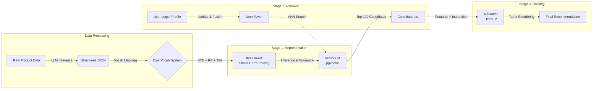

# 🛍️ LLM-Driven Hybrid Recommendation System

## 📖 Overview
이 프로젝트는 **LLM(Large Language Model)을 활용한 고품질 Feature Engineering**과 **Contrastive Learning(SimCSE)** 기반의 임베딩 학습을 결합한 차세대 커머스 추천 시스템입니다.

기존의 단순 협업 필터링(CF)이나 텍스트 기반 검색의 한계를 넘어, 상품의 **구조적 속성(Standard)**과 **비정형 상세 속성(Reinforced)**을 **Cross-Attention**으로 융합하여 정교한 벡터 공간을 구축합니다. 이를 바탕으로 **Two-Tower 구조의 Retrieval(후보 추출)**과 **DeepFM 기반의 Reranking(정밀 정렬)** 파이프라인을 통해 유저의 신체 정보와 맥락까지 고려한 초개인화 추천을 제공합니다.

---

## 🏗️ System Architecture

전체 파이프라인은 데이터 전처리, 후보 추출(Retrieval), 정밀 정렬(Reranking)의 3단계로 구성됩니다.



## 🔑 Key Logics & Features

### 1. Hybrid Vocabulary System (Data Strategy)
LLM이 추출한 피처를 성격에 따라 두 가지 Vocab으로 분리하여 **연산 효율성**과 **표현력**을 동시에 확보했습니다.
* **STD (Standard) Vocab:** 카테고리, 브랜드, 성별 등 고정된 도메인 피처. 단일 통합 임베딩 테이블을 공유하여 메모리를 최적화합니다.
* **RE (Reinforced) Vocab:** 소재, 핏, 스타일, 상품명(Title) 등 가변적인 상세 속성. 동적으로 확장 가능한 Vocab 구조를 가집니다.
* **ID Mapping:** 모든 텍스트 피처를 고유 ID로 매핑하여 Cross-Attention 시 노이즈를 제거하고 **직교성(Orthogonality)**을 확보합니다.

### 2. Stage 1: Item Tower (Coarse-to-Fine Representation)
상품의 본질적인 의미(Semantic)를 벡터화하는 단계입니다.
* **Architecture:** Transformer-based Encoder + MLP Projection Head
* **Cross-Attention Mechanism:**
    * **Query (Anchor):** STD 피처 (예: "남성 상의") → 변하지 않는 기준점
    * **Key/Value (Context):** RE 피처 + Title Tokens (예: "린넨", "오버핏", "여름 신상") → 보강 정보
    * *Effect:* 표준 속성이 상세 속성을 참조하여 벡터를 강화(Reinforce)하는 구조.
* **Training Objective (SimCSE):**
    * **Augmentation:** Feature Dropout & Token Masking을 통해 Positive Pair 생성.
    * **Loss:** `NTXentLoss` (InfoNCE) with In-batch Negatives.
    * **Normalization:** 추론 시 L2 Normalization을 적용하여 Cosine Similarity 검색에 최적화.

### 3. Stage 2: User Tower (Multi-modal Retrieval)
유저의 행동, 현재 의도(Context), 신체 정보를 결합하여 선호 아이템을 탐색합니다.
* **3-Way Multi-modal Fusion:**
    1.  **Behavior:** 과거 구매/클릭 이력 Sequence (Pre-trained Item Vector Lookup + Transformer).
    2.  **Context:** 장바구니 컨셉 텍스트 (Transformer Encoder).
    3.  **Profile:** 키(Height), 몸무게(Weight) 등 수치형 데이터 (Linear Projection & Z-score Norm).
* **Strategy:** Item Tower의 가중치는 **Freeze(고정)**하고, 유저 타워만 학습하여 유저 벡터를 아이템 벡터 공간에 정렬(Alignment)시킵니다.

### 4. Stage 3: Reranker (Fine-grained Ranking)
Retrieval 단계에서 추려진 후보군을 정밀하게 재정렬합니다.
* **Model:** **DeepFM (Deep Factorization Machine)**
* **Weight Transfer:**
    * SimCSE로 학습된 **STD/RE 임베딩 가중치**를 DeepFM의 Sparse Feature Embedding으로 **이식(Transfer)**하여 초기 학습 성능을 극대화합니다.
* **Feature Interaction:**
    * **Sparse Feat:** 카테고리, 브랜드, RE 속성 (Shared Embeddings).
    * **Dense Feat:** 유저 키, 몸무게.
    * **Implicit Interaction:** DNN을 통해 고차원 상호작용 모델링.

---

## 📂 Project Structure

```text
├── api_controller/      # FastAPI Serving Logic
├── vocab.py             # ID Mapping & Dynamic Vocabulary Management
├── model_simcse.py      # [Stage 1] Item Tower Definition (Encoder)
├── model_reranker.py    # [Stage 3] DeepFM Reranker Definition (Build & Transfer)
├── train_simcse.py      # SimCSE Training Pipeline
├── train_reranker.py    # DeepFM Training Pipeline
└── saved_models/        # Model Weights Directory
    ├── encoder_stage1.pth  # SimCSE Pre-trained Encoder
    └── reranker_deepfm.pth # DeepFM Trained Weights

```

## 🛠 Tech Stack

| Category | Technology | Description |
| :--- | :--- | :--- |
| **Core Framework** | **PyTorch** | Deep Learning Model Training & Inference (v1.12.1) |
| **API Server** | **FastAPI** | High-performance Async API for Real-time Serving |
| **NLP & Tokenizer** | **HuggingFace Transformers** | `DistilBERT` for Title/Text Feature Encoding |
| **Ranking Model** | **DeepCTR-Torch** | Implementation of **DeepFM** for Fine-grained Reranking |
| **Loss Function** | **PyTorch Metric Learning** | `NTXentLoss` (InfoNCE) for Contrastive Learning |
| **Vector Database** | **PostgreSQL (pgvector)** | Vector Storage & Inner Product (IP) Similarity Search |
| **Optimization** | **AdamW, GELU** | Optimizer & Activation Function for Transformer |