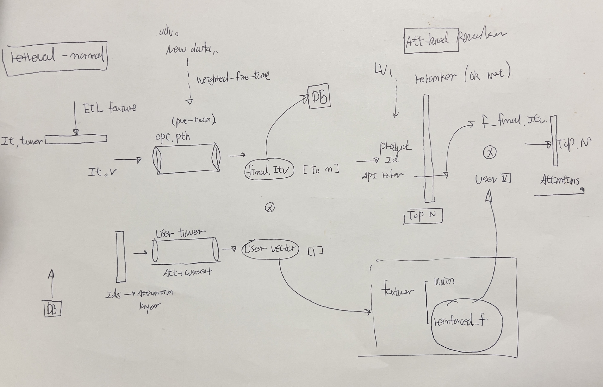
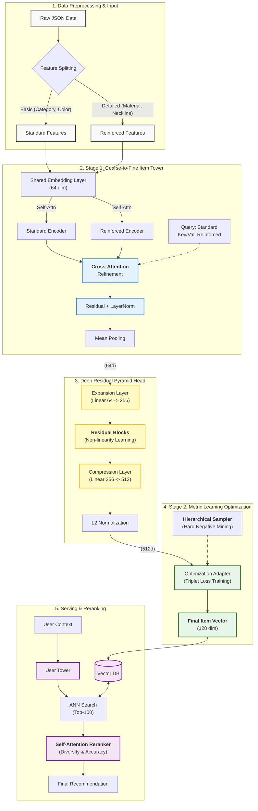

### 구조도

# Deep Coarse-to-Fine Metric Learning Recommendation System

> **LLM 기반의 고품질 피쳐와 계층적 메트릭 러닝을 활용한 하이브리드 추천 시스템**
> *Zero-shot Cold Start 해결 및 Diversity Reranking 구현*

## 프로젝트 개요 (Overview)

이 프로젝트는 기존 협업 필터링(CF)의 한계인 **Cold Start** 문제와 **인기 편향(Popularity Bias)**을 해결하기 위해 구축된 딥러닝 기반 추천 시스템입니다.

LLM을 통해 정제된 **구조적 속성(Structured Attributes)**을 활용하며, Coarse-to-Fine (Cross-Attention) 아키텍처와 Deep Pyramid 구조를 통해 상품의 미세한 뉘앙스까지 벡터 공간에 반영합니다.

## 시스템 아키텍처 (System Architecture)

전체 파이프라인은 **[Feature Extraction] → [Stage 1: Embedding] → [Stage 2: Optimization] → [Serving]** 단계로 구성됩니다.

## 핵심 기술 (Key Features)

#### 1. Coarse-to-Fine Cross-Attention

- 문제: 단순 Concat 방식은 세부 속성(Reinforced)의 노이즈가 핵심 속성(Standard)을 희석시킴.

- 해결: Standard 피쳐를 Query로, Reinforced 피쳐를 Key/Value로 사용하는 Cross-Attention 도입.

- 효과: "코트"라는 본질을 유지하면서 "캐시미어", "네이비" 등의 세부 정보를 선별적으로 흡수하여 강건한 임베딩 생성.

#### 2. Deep Residual Pyramid Head

 - 구조: Expand(64->256) → Residual Blocks → Compress(256->512).

 - 원리: 정보를 넓게 펼쳐(Expansion) 비선형적 관계를 학습한 뒤, 병목(Bottleneck) 구조를 통해 핵심 정보만 압축.

 - 성과: 단순 MLP 대비 복합 속성(예: 여름+니트+검정)의 문맥 이해도 상승.

#### 3. Hierarchical Metric Learning

    전략: 도메인 지식(카테고리 계층)을 반영한 Hierarchical Batch Sampling.

    방법: 배치 내에 의도적으로 Coat와 Jacket을 함께 구성하여 모델에게 Hard Negative 문제를 지속적으로 출제.

    결과: 유저 로그가 없는 신상품에 대해서도 정교한 벡터 위치를 찾아내어 Zero-shot Cold Start 해결.

#### 4. Diversity-Aware Serving

    Reranker: Transformer 기반의 Self-Attention Reranker 도입.

    기능: 추천 후보 리스트 전체를 조망하여, 유사도가 지나치게 높은 중복 상품을 필터링(MMR 효과).

    지표: Catalog Coverage 및 ILD(Intra-List Diversity) 지표 대폭 개선.